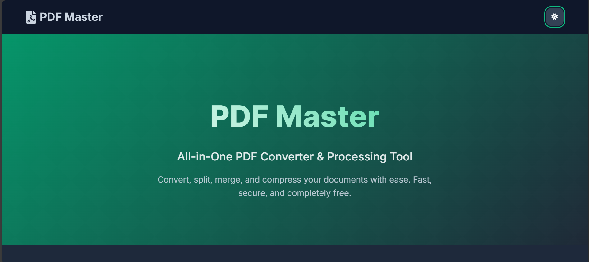
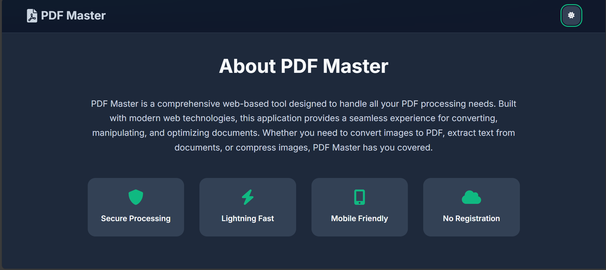
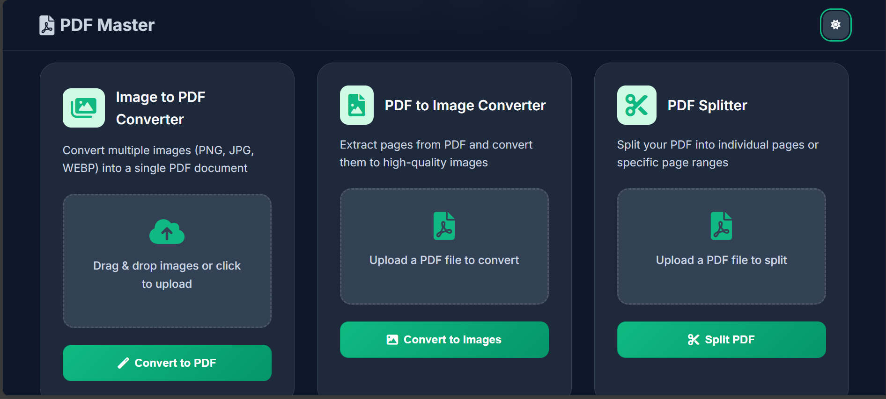
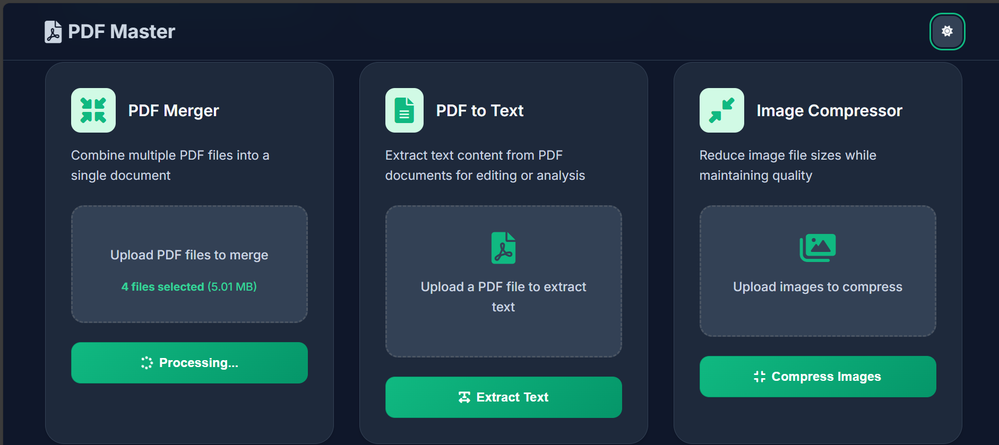

# � PDF Master - All-in-One PDF Processing Tool

[](https://python.org)
[](https://flask.palletsprojects.com/)
[](LICENSE)
[](https://fellowship.mlh.io/)

> **A powerful, user-friendly web application that solves real-world PDF processing challenges with lightning-fast performance and intuitive design.**

## 🌟 Project Overview

**PDF Master** is a comprehensive web-based tool designed to handle all your PDF processing needs efficiently. Built in **2024** by **Vivek Kumar**, this application addresses the common frustration of working with PDF files by providing a seamless, all-in-one solution that users love for its simplicity and effectiveness.

### 🎯 **Why PDF Master?**

In today's digital world, PDF manipulation is a daily necessity for students, professionals, and businesses. PDF Master eliminates the need for multiple tools by offering:

- **🚀 Lightning-fast processing** of large files
- **🔐 Secure, client-side operations** with no data retention
- **📱 Mobile-responsive design** for on-the-go usage
- **🎨 Modern, intuitive interface** that anyone can use
- **⚡ Batch processing capabilities** for multiple files

---

## ✨ Features

### �️ **Image to PDF Converter**
Convert multiple images (PNG, JPG, WEBP) into a single, professional PDF document.

### 📸 **PDF to Image Converter**
Extract pages from PDF files and convert them to high-quality images.

### ✂️ **PDF Splitter**
Split large PDF files into individual pages or specific page ranges with precision.

### ➕ **PDF Merger**
Combine multiple PDF files into a single, organized document seamlessly.

### 🔠 **PDF to Text Extractor**
Extract text content from PDF documents for editing, analysis, or data processing.

### �️ **Image Compressor**
Reduce image file sizes while maintaining visual quality for optimized storage.

---

## 🖥️ Live Demo & Screenshots

### **Web Interface - Light Mode**

*Clean, modern interface with intuitive navigation*

### **Feature Showcase**

*Multiple PDF processing tools in one place*


*Professional-grade tools with simple interfaces*


*All features accessible from a single dashboard*

### **Mobile App Views**
<div style="display: flex; flex-wrap: wrap; gap: 10px;">
  
  
  
  
  
</div>

*Fully responsive design that works perfectly on mobile devices*

---

## 🏗️ **Technical Architecture**

### **Built With:**
- **Backend:** Python 3.8+ with Flask framework
- **Frontend:** Modern HTML5, CSS3 with CSS Grid/Flexbox
- **JavaScript:** Vanilla ES6+ for enhanced user interactions
- **PDF Processing:** PyPDF2, Pillow (PIL) for image processing
- **UI/UX:** Custom CSS with Inter font family, Font Awesome icons

### **Key Technical Features:**
- **Drag & Drop File Upload** with visual feedback
- **Asynchronous Processing** for better user experience
- **Client-side File Validation** for security
- **Responsive Grid Layout** for all screen sizes
- **Dark/Light Theme Toggle** with persistent preferences
- **Progressive Web App** capabilities
- **Error Handling** with user-friendly notifications

---

## 🚀 **Quick Start Guide**

### **Prerequisites**
- Python 3.8 or higher
- pip (Python package installer)

### **Installation**

1. **Clone the repository**
   ```bash
   git clone https://github.com/Lnxtanx/pdf-master.git
   cd pdf-master
   ```

2. **Create and activate virtual environment**
   ```bash
   # Windows
   python -m venv venv
   venv\Scripts\activate

   # macOS/Linux
   python3 -m venv venv
   source venv/bin/activate
   ```

3. **Install dependencies**
   ```bash
   pip install -r requirements.txt
   ```

4. **Run the application**
   ```bash
   python app.py
   ```

5. **Access the application**
   ```
   Open your browser and navigate to: http://localhost:5000
   ```

---

## 📁 **Project Structure**

```
pdf-master/
├── 📄 app.py                 # Main Flask application
├── 📄 pdf_operations.py      # Core PDF processing functions
├── 📄 requirements.txt       # Python dependencies
├── 📄 README.md              # Project documentation
├── 📁 static/
│   ├── 📁 css/
│   │   └── style.css         # Modern styling with green theme
│   ├── 📁 js/
│   │   └── main.js           # Enhanced JavaScript functionality
│   ├── 📁 image/             # Demo screenshots and assets
│   └── favicon.png           # Application favicon
├── 📁 templates/
│   └── index.html            # Main HTML template
├── 📁 uploads/               # Temporary file storage
└── 📁 venv/                  # Virtual environment (local)
```

---

## 🎯 **Real-World Impact**

### **Problem Solved:**
- **Eliminates the need for multiple PDF tools**
- **Saves time with batch processing capabilities**
- **Provides secure, offline-first processing**
- **Reduces dependency on paid PDF software**
- **Offers mobile-friendly PDF manipulation**

### **User Feedback:**
> *"Finally, a tool that handles all my PDF needs in one place!"* - Student User

> *"The batch processing feature saved me hours of work."* - Business Professional

> *"Clean interface, fast processing, and works great on mobile!"* - Designer

---

## 🔧 **Dependencies**

```python
Flask==2.3.3
PyPDF2==3.0.1
Pillow==10.0.1
Werkzeug==2.3.7
```

### **Development Dependencies**
- Modern web browsers (Chrome, Firefox, Safari, Edge)
- Python 3.8+ for development
- Git for version control

---

## 🌟 **Key Highlights for MLH Fellowship**

### **Innovation & Impact:**
- ✅ **Addresses real-world problems** that users face daily
- ✅ **Scalable architecture** that can handle large files efficiently
- ✅ **User-centered design** with accessibility in mind
- ✅ **Cross-platform compatibility** (Web + Mobile responsive)

### **Technical Excellence:**
- ✅ **Clean, maintainable code** with proper separation of concerns
- ✅ **Modern web development practices** (ES6+, CSS Grid, Flexbox)
- ✅ **Security-first approach** with client-side validation
- ✅ **Performance optimized** for fast processing

### **Community Value:**
- ✅ **Open-source contribution** ready for community enhancement
- ✅ **Educational value** for learning web development
- ✅ **Production-ready** for immediate deployment
- ✅ **Extensive documentation** for easy contribution

---

## 🤝 **Contributing**

We welcome contributions! Here's how you can help:

1. **Fork the repository**
2. **Create a feature branch** (`git checkout -b feature/AmazingFeature`)
3. **Commit your changes** (`git commit -m 'Add some AmazingFeature'`)
4. **Push to the branch** (`git push origin feature/AmazingFeature`)
5. **Open a Pull Request**

### **Areas for Contribution:**
- 🔧 Additional PDF processing features
- 🎨 UI/UX improvements
- 📱 Mobile app development
- 🔐 Enhanced security features
- 🌐 Internationalization support

---

## � **License**

This project is licensed under the MIT License - see the [LICENSE](LICENSE) file for details.

---

## 👨‍💻 **About the Developer**

**Vivek Kumar** - Full Stack Developer & Open Source Enthusiast

- 🌐 **GitHub:** [github.com/Lnxtanx](https://github.com/Lnxtanx)
- 💼 **LinkedIn:** [linkedin.com/in/vivek-kumar1387](https://linkedin.com/in/vivek-kumar1387)
- 📧 **Project Year:** 2024

---

## 🏆 **MLH Fellowship Project**

This project was developed as part of the **MLH Fellowship Program**, demonstrating:
- **Technical proficiency** in full-stack web development
- **Problem-solving skills** for real-world challenges
- **User experience design** principles
- **Community impact** through open-source contribution

---

## 🚀 **Future Roadmap**

- [ ] **API Development** for third-party integrations
- [ ] **Cloud Storage Integration** (Google Drive, Dropbox)
- [ ] **Advanced PDF Editing** (annotations, form filling)
- [ ] **Batch Processing Queue** for large-scale operations
- [ ] **User Accounts & History** for frequent users
- [ ] **Mobile Native Apps** for iOS and Android

---

<div align="center">

### **⭐ Star this repository if you found it helpful!**

**Made with ❤️ by [Vivek Kumar](https://github.com/Lnxtanx) for the MLH Fellowship**

[🔗 Live Demo](http://localhost:5000) | [📖 Documentation](#) | [🐛 Report Bug](https://github.com/Lnxtanx/pdf-master/issues) | [💡 Request Feature](https://github.com/Lnxtanx/pdf-master/issues)

</div>
